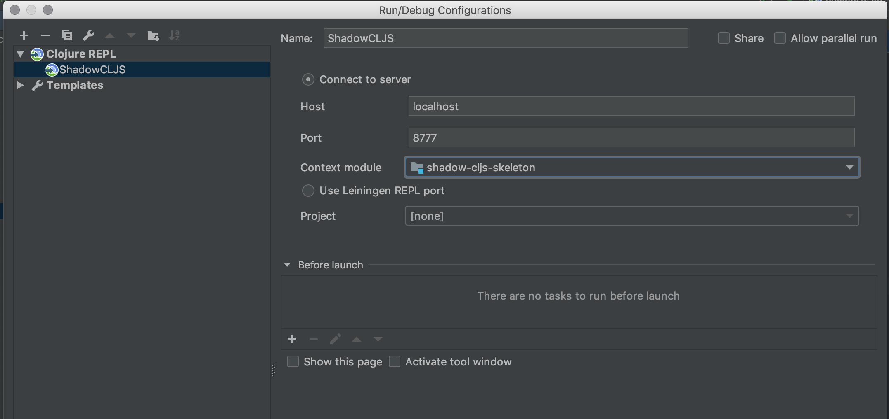

## Setup
+ do NOT install the `shadow-cljs` npm package globally even though that's recommended in the [Shadow CLJS guide](https://shadow-cljs.github.io/docs/UsersGuide.html).
+ `$ lein new shadow-cljs shadow-cljs-skeleton +reagent` (which uses https://github.com/shadow-cljs/lein-template which also lives on clojars.org here: [https://clojars.org/shadow-cljs/lein-template](https://clojars.org/shadow-cljs/lein-template))
+ ALTERNATIVE: https://github.com/lauritzsh/reagent-shadow-cljs-starter/
+ `$ yarn`

### Cursive (IntelliJ Clojure plugin)
+ `$ yarn shadow-cljs pom` (required for Cursive to recognize a Java project)
+ right-click on `pom.xml` in IntelliJ's file sidebar and click on "Add as Maven project"
+ Run > Edit Configurations > "+" (top-left) > Clojure REPL Remote
+ set up like on screenshot:
  
+ run `> (shadow/repl :app)` to connect from Clojure REPL to browser JS console.


## Start development server
+ `$ yarn shadow-cljs watch app`

# {{name}}

## Run

``` shell
yarn install

yarn watch
```

## Clean

``` shell
yarn clean
```

## Release

``` shell
yarn release
```

## License

Copyright © 2017 FIXME

Distributed under the Eclipse Public License either version 1.0 or (at
your option) any later version.
